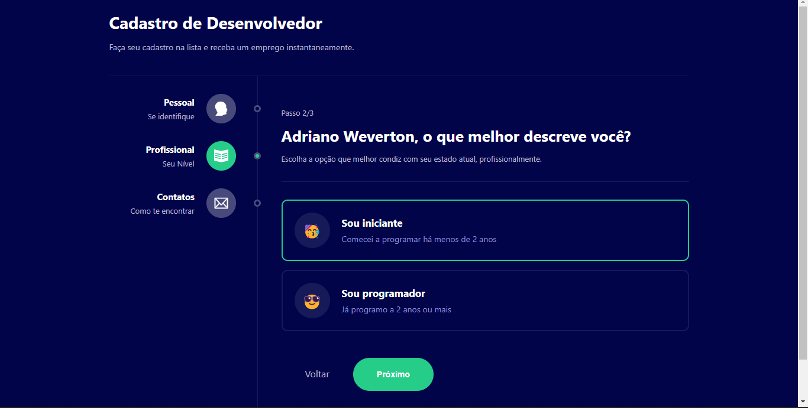

# Time Tracking App
[](https://github.com/AdrianoWeverton/Time-Traking-App/blob/master/LICENSE) 

# Sobre o projeto


Multiform é um projeto front-end desenvolvido durante o desafio react em 5 dias do curso de programação da plataforma b7 web. A aplicação consiste na criação de um formulário multietapas sendo o público alvo desenvolvedores. 


## Layout




# Tecnologias utilizadas

## Front end
- ReactJS / TypeScript
- Styled Componentes

## Implantação em produção=
- Front end web: Netlify

# Como executar o projeto
Pré-requisitos: npm / yarn

```bash
# clonar repositório
git clone https://github.com/AdrianoWeverton/Time-Traking-App.git

# entrar na pasta do projeto front end web
cd Time-Tracking-App

```bash
# clonar o repositório
git clone https://github.com/AdrianoWeverton/multi-form.git

# entrar na pasta do projeto
cd multi-form

# instalar dependências
npm install

# executar o projeto
npm start

```